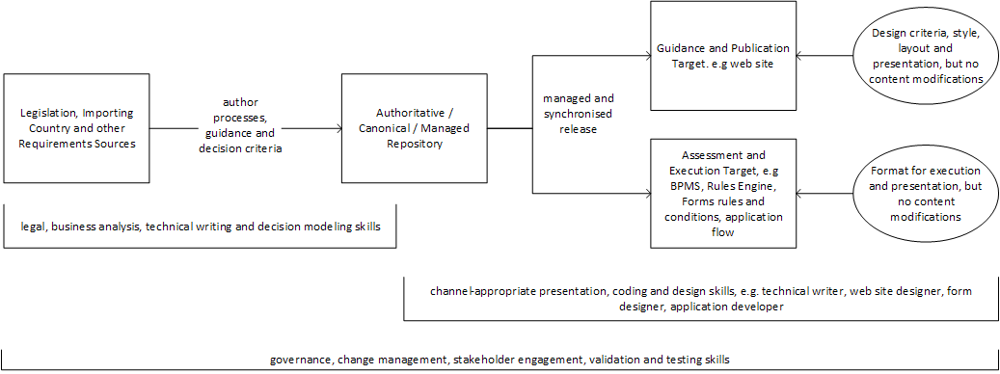

# requirements
This repository provides a content management system for requirements. It is organised by commodity and each country has a folder within each commodity. Within each commodity + country folder is a file called "readme.md". This file contains the guidance for the country and commodity.

Both commodities and countries can have sub-folders. For example, the European Union has sub-folders for member countries. If a country or commodity has information in its readme file and it also has a sub-folder, then the information is merged.

